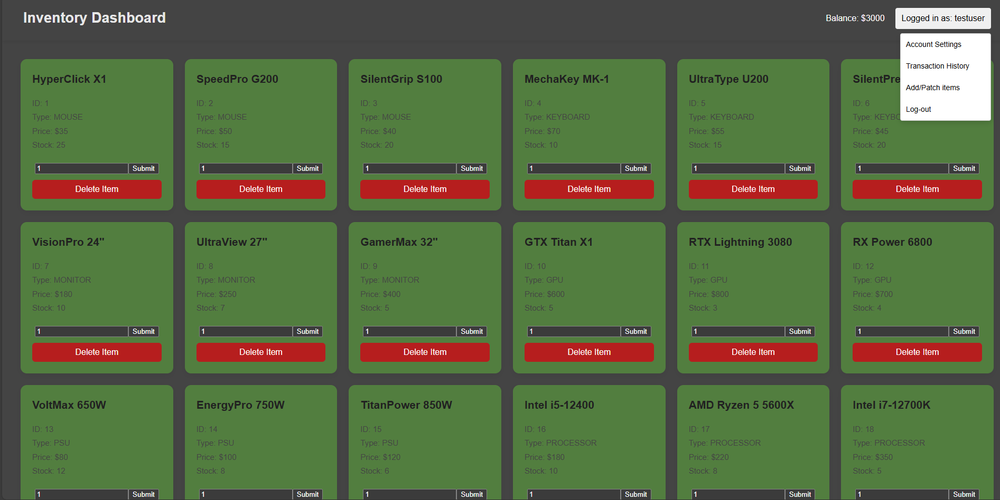
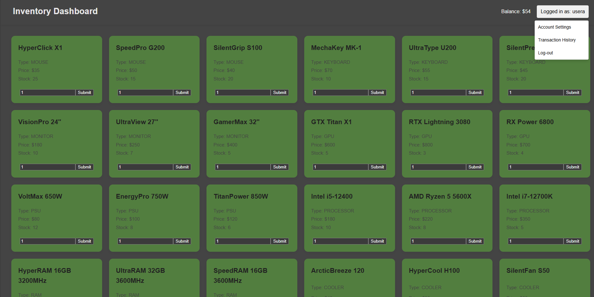
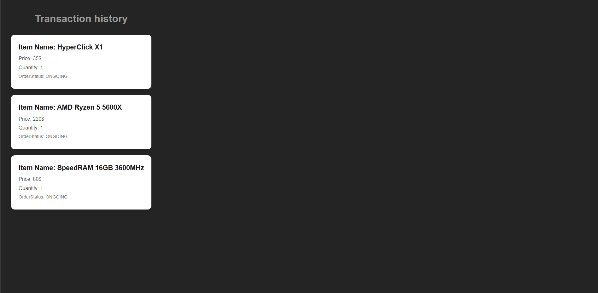

# 🛒 OrderComputerInventory — Spring Boot & React

A full-stack web application that mimics an online store for PC components.  
The system is built using **Clean Architecture**, ensuring scalability, modularity, and maintainability.


---

## 🚀 Tech Stack

| Layer      | Technologies |
|-----------|-------------|
| Frontend  | React, Vite, TypeScript, Tailwind |
| Backend   | Java 17, Spring Boot 3, Spring Security, Spring Data |
| Messaging | RabbitMQ |
| Database  | PostgreSQL |
| Testing   | JUnit 5, Mockito |
| DevOps    | Docker, Docker Compose |

---

## ✨ Features

- 🔐 Role-based authentication (User / Admin)
- 👤 Complete account & profile management
- 🛍 Inventory & transaction system
- 🧾 Order tracking with delivery address
- 👑 Admin panel for adding/editing inventory
- 🐇 RabbitMQ for asynchronous transaction processing
- 💳 Users start with a **default balance**
- 🧪 Unit testing using Mockito
- 🐳 Fully Dockerized — no manual setup required

---

## 🟢 Running with Docker

```bash
git clone https://github.com/ZeroDay0101/OrderComputerInventory.git
cd OrderComputerInventory
docker-compose up --build
```
---
## 🔑 Default Credentials

| Role  | Username | Password |
|-------|----------|----------|
| Admin | admin    | admin    |
| User  | user     | user     |

Default users can be disabled in `application.properties` by setting:  
`application.enable-test-configuration=false`

---

## 🌐 API Endpoints

| Method | Endpoint                 | Operation / Description                                    |
|--------|--------------------------|------------------------------------------------------------|
| GET    | `/api/order`             | `getOrder` — Fetch order by `orderId`                     |
| PATCH  | `/api/order`             | `updateOrderStatus` — Update order status                 |
| GET    | `/api/order/user`        | `getOrders` — Get all orders for a user                   |
| PATCH  | `/api/inventory`         | `updateItem` — Update an inventory item                   |
| POST   | `/api/inventory`         | `addItem` — Add new inventory item                        |
| DELETE | `/api/inventory`         | `deleteItem` — Delete item by `itemId`                    |
| GET    | `/api/inventory`         | `getItems` — Get all inventory items                      |
| GET    | `/api/inventory/item`    | `getItem` — Get item by `itemId`                          |
| POST   | `/api/register`          | `register` — Register new user                             |
| POST   | `/api/login`             | `login` — User login                                       |
| GET    | `/api/login`             | `checkIfUserAuthenticated` — Validate current user session |
| PATCH  | `/api/user`              | `updateUser` — Update user details                        |
| DELETE | `/api/user`              | `deleteUser` — Delete user by id                           |
| GET    | `/api/user`              | `getUser` — Fetch user by id                               |
| PATCH  | `/api/user/address`      | `setUserAddress` — Set or update user address             |
| GET    | `/api/user/me`           | `getInfoOfUserMakingTheRequest` — Get authenticated user details |
| GET    | `/api/user/allUsers`     | `getAllUsers` — Get list of all users                     |
| POST   | `/api/transaction`       | `makeTransaction` — Create a transaction                  |
| GET    | `/api/transaction`       | `getTransactionDetails` — Get transaction by `transactionId` |
| GET    | `/api/transaction/user`  | `getUserTransactions` — Get all transactions for a user  |

---

## ⚙️ Architecture Overview

The backend applies **Clean Architecture**:

├─ Controller (REST API)

├─ Service (business logic)

├─ Repository (data persistence)

├─ Messaging (RabbitMQ)

└─ DTO / Mapper layer


**Benefits:**

- Decoupled modules
- Minimal code duplication
- Easier testing using mocks
- Smooth scalability when adding new modules

---

## 🐳 Docker Services

| Service     | Purpose                                                   |
|------------|-----------------------------------------------------------|
| PostgreSQL  | Database for orders, users, balance, address, inventory  |
| RabbitMQ    | Asynchronous transaction processing                      |
| Spring Boot | Backend API                                               |
| React       | Frontend                                                  |

> All containers and networking are configured in `docker-compose.yml`.

---

## 📎 Important Notes

- Page accessible at `http://localhost:5173`
- Items can be added only by an **Admin**
- Users start with initial balance defined in `application.properties` under `application.default-user-balance`
## 👁️ A few example images:
- **Main page** admin perspective:


- **Main page** user perspective


- **Transaction history** page:


